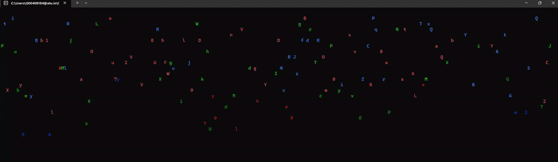

# Home / Introduction

---
[🏠 Home](index.md) | [🎨 Design](design.md) | [🧠 Algorithm](algorithm.md) | [🐞 Debugging](problemsolving.md) | [🧠 Reflection](reflection.md)

## 🌧️ Digital Rain in Modern C++

Welcome to my blog on creating a **Digital Rain** effect using **Modern C++**! This project was inspired by the iconic Matrix-style digital rain, and explores graphics, algorithm design, and performance.

[👉 Jump to the Design](design.md) | [See the Code](algorithm.md) | [Debugging](problemsolving.md) | [Reflection](reflection.md)

---

## 🎯 Project Overview

- ✅ Random falling characters
- ✅ Character fading/lifespan
- ✅ Real-time Windows console rendering
- ✅ Modular object-oriented design

